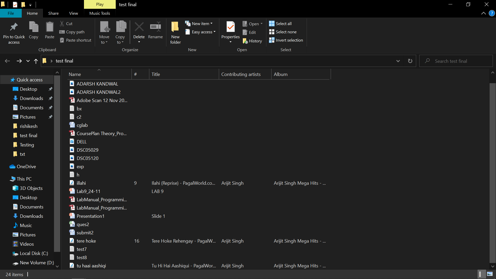
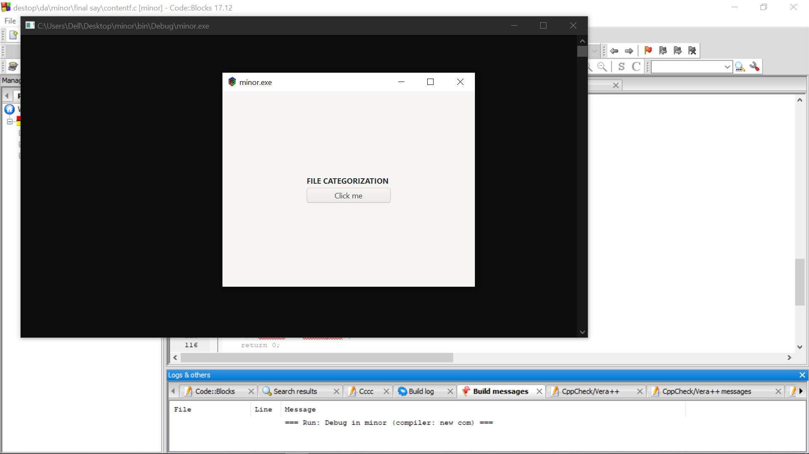
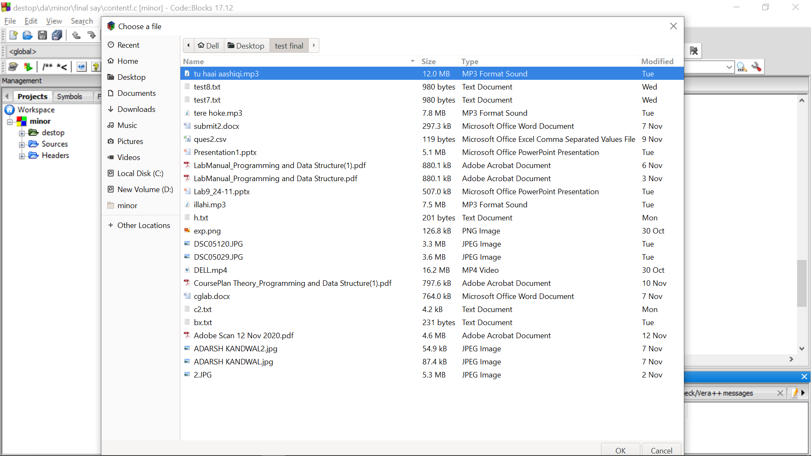
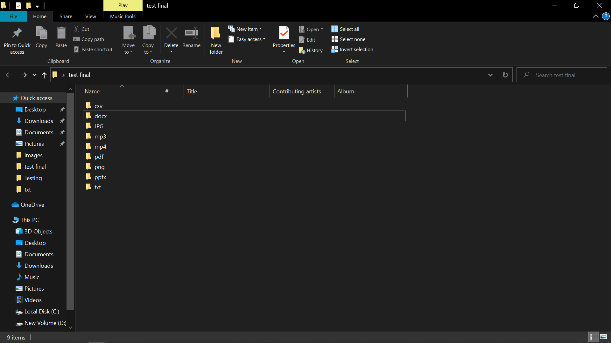
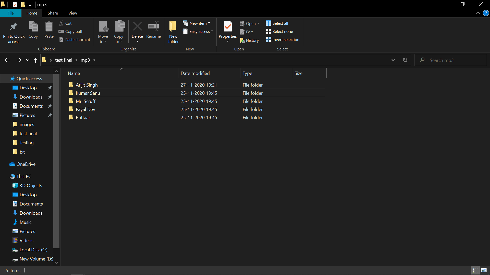
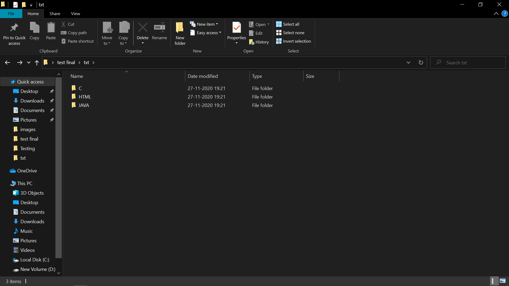

# Minor_Project_1

File Categorization based on Extension and Content using C

<b>Project Mentor</b>- Dr Hitesh Kumar Sharma

<b>Group members:</b>
1. Adarsh Kandwal
2. Gourav Paul
3. Dev Chauhan

UNIVERSITY OF PETROLEUM AND ENERGY STUDIES,
BIDHOLI, DEHRADUN, UTTRAKHAND, INDIA

<h2>IMPLEMENTATION</h2>

<h3>1.Target Folder</h3>

<h3>2.GTKMM Menu</h3>

<h3>3.File chooser Dialog using GTKMM</h3>

<h3>4.Results of the Algorithm Based on Extension</h3>
<h4> a.Target Folder</h4>

<h3>5.Result of Algorithm based on content</h3>
<h4>a.Music Categorization based on "Artist"<h4>

<h4>b.Text Classification based on "Code or Script" in them</h4>

